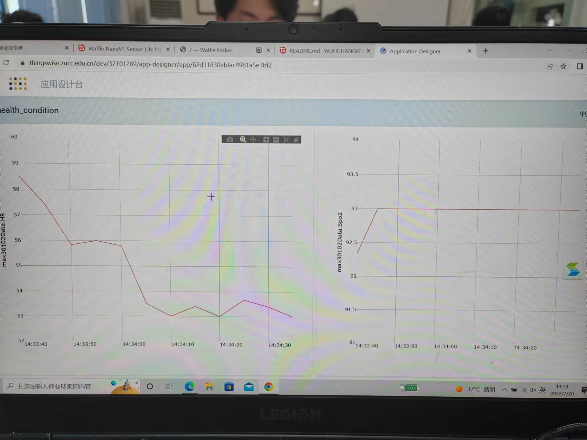

# Waffle Nano老人用便携血氧心率测量仪

#### 介绍
制作一个通过MAX30102脉搏血氧浓度传感器帮助老年人群体随时监测自己的健康状况，持续读取red，ir的值,通过算法计算得到血氧饱和度以及心率，给用户较大字体显示血氧饱和度以及心率图像，以便于用于居家老年人的血氧测量，通过蜂鸣器来警示血氧以及心率等数值的异常，并上传到thingswise idos平台实现数据可视化，实现长期监控。

#### 概览

#### 功能简介

1.  实时测量心率和血氧
2.  对于异常血氧和心率数值进行报警
3.  在thingswise平台上展示传感器读取数据

#### 使用说明

只需要将手指放上max30102传感器，传感器即可读取心率血氧数据并将其显示在waffle Nano上

#### 硬件部分
##### MAX30102

#### 特技

1.  使用 Readme\_XXX.md 来支持不同的语言，例如 Readme\_en.md, Readme\_zh.md
2.  Gitee 官方博客 [blog.gitee.com](https://blog.gitee.com)
3.  你可以 [https://gitee.com/explore](https://gitee.com/explore) 这个地址来了解 Gitee 上的优秀开源项目
4.  [GVP](https://gitee.com/gvp) 全称是 Gitee 最有价值开源项目，是综合评定出的优秀开源项目
5.  Gitee 官方提供的使用手册 [https://gitee.com/help](https://gitee.com/help)
6.  Gitee 封面人物是一档用来展示 Gitee 会员风采的栏目 [https://gitee.com/gitee-stars/](https://gitee.com/gitee-stars/)
